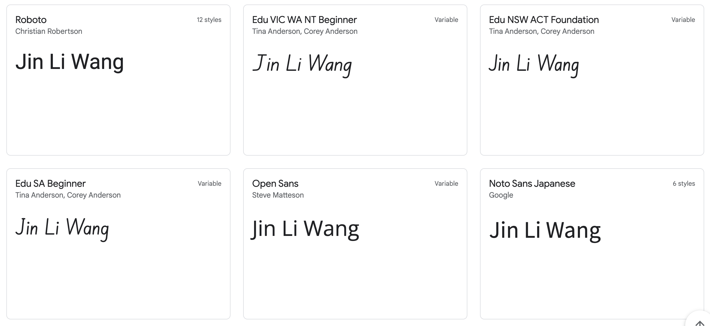
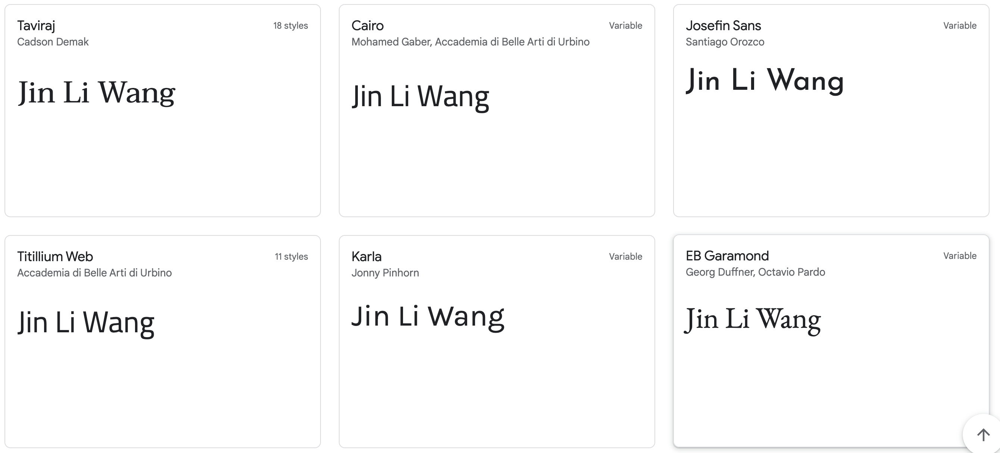
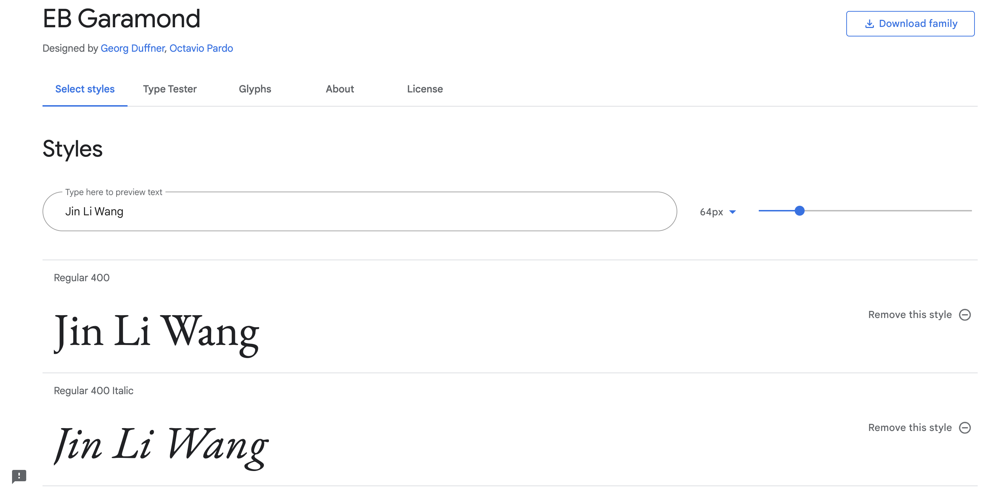
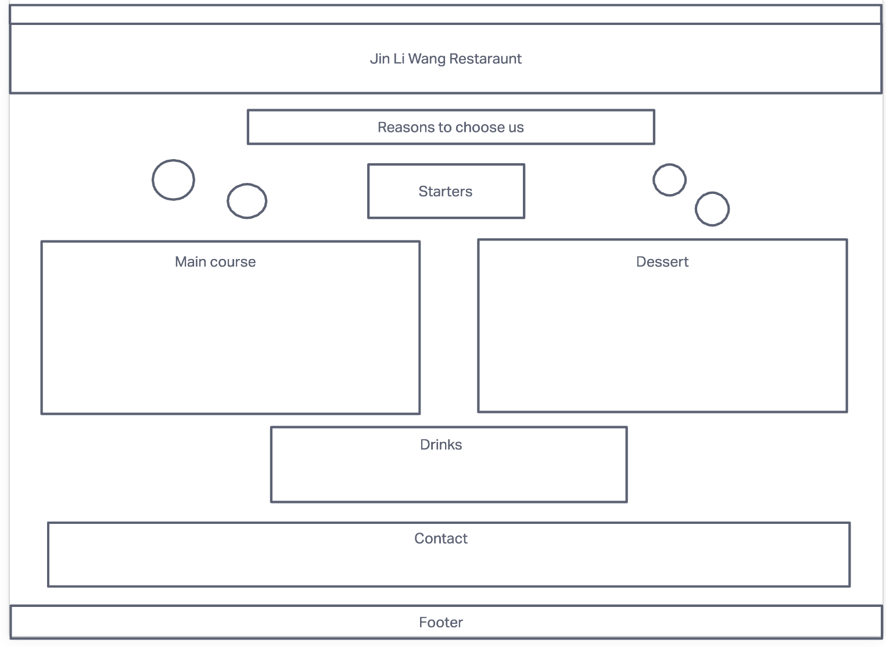
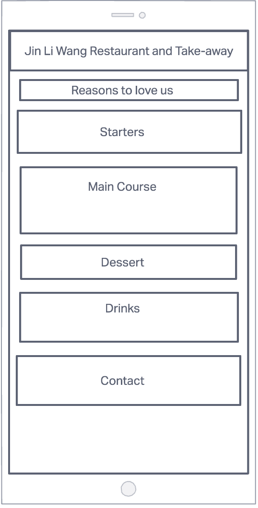
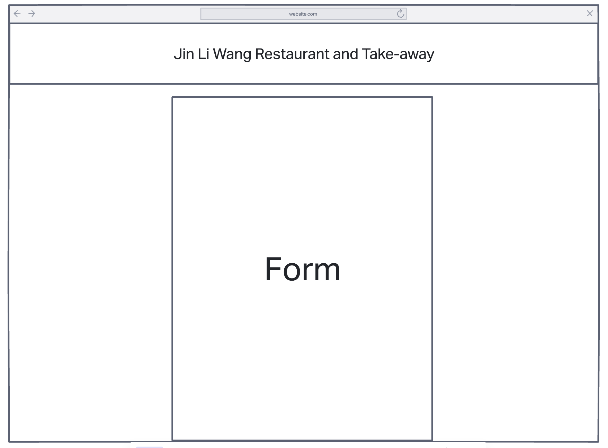
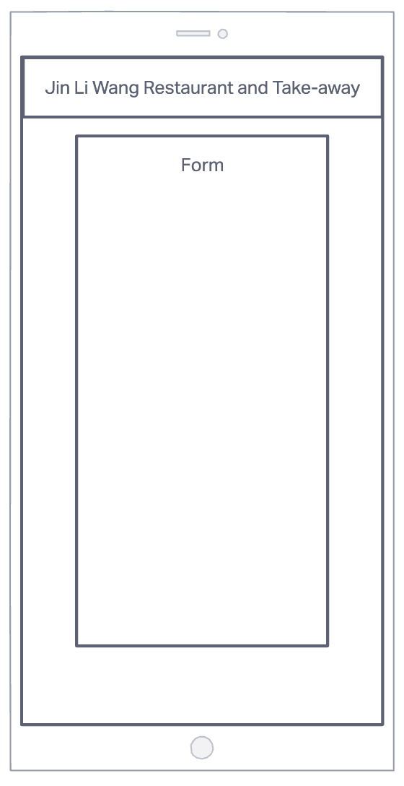

# Jin Li Wang Restaurant and Take-away

Welcome to the readme file of my project.

## Introduction
Chinese culture has been a huge part of my life. Chinese food always makes an appearace on our kitchen table, whether it's in the morning, afternoon or the evening. Even though, I grew up outside of China and have only tasted a limited amount of chinese food, I still want to share my personal experience with you. If you have the chance to visit China, don't forget to try food that isn't on this list;).

You can find a link to my website [here]()

# Table of Contents
[1.User Experience(UX)]()
- [1.1 User Goals](#user-goals)
- [1.2 User Expectations](#user-expectations)
- [1.3 Colour Scheme and Font](#color-scheme-and-font)
- [1.4 Visual Images](#visual-images)
- [1.5 Skeleton Framework](#skeleton-framework)
    - [1.5.1 Front Page](#front-page)
    - [1.5.2 Recruitment and Survey Page](#recruitment-and-survey-page)

[2.Features](#features)

[3.Technology](#technology)

[4.Testing](#testing)

[5.Bugs](#bugs)

[6.Deployment](#deployment)

[7.Acknowledgements](#acknowledgements)

# 1. User Experience

## 1.1 User Goals

[Return to the Table of Contents](#table-of-contents)

My goal in creating a menu for this project is to introduce people to the chinese culture especially the chinese cuisine. Chinese cuisine has been around for at least five thousand years. It has changed a lot over this long period of time but the essence remains the same. So, I wanted to share some of my country's famous dishes with everyone!

## 1.2 User Expectations

[Return to the Table of Contents](#table-of-contents)

The website should contain information about the chinese restaurant itself and the food it serves. It should contain descriptions of each dish and hopefully have an image of each dish.

The following are expected of this website:

* Should be easy to use and accessable on all electronic appliances.
* Should be visually appealing and contain the necessary information for the user.
* Should contain the address so that users of the website can locate the restaurant.
* Should contain contact information so that users can ask questions, book in or order food.
* Should be able to apply for a job at the restaraunt online.

## 1.3 Color Scheme and Font

[Return to the Table of Contents](#table-of-contents)
### 1.3.1 Colors

The color scheme for this website are light colors. I think that the correct use of color is one of the key elements that attracts users to a website. In my opinion, I think light colors are more gentle on the eye when flicking through a website. I used the rgb color values as the main color inputs in my project.

### 1.3.2 Fonts

The way I decided on the font style was using google fonts. I inserted the name "Jin Li Wang" into google fonts and scrolled through the list until I saw the one that was the most suitable. It took a while but eventually I decided on the font below.

I used different font sizes in my project based on the placement of items and pieces of code. The sizing adjusts itself according to the screen size. I think this is important as having a font that is too big on a small iphone screen will definitely decreases a visitor's appeal and opinion of the website.

## 1.4 Visual Images

[Return to the Table of Contents](#table-of-contents)

I used pixabay as my main source of image gathering for my project. I feel like visual context is more appealing to visitors visiting my website since it is a food-based one. This would engage the visitors more and hopefully will attract them to actually book a table and try the dish out. 

Images also add to the quality of a website as it makes it more appealing to the eye by adding colors and shapes rather than words.

## 1.5 Skeleton Framework

[Return to the Table of Contents](#table-of-contents)

Invision was used to create the webframe and to brainstorm my ideas. I created four altogether, two for the webpage and two for an iphone screen.

I created three web pages altogether for my website, one for the home page, one for a survey page and one for a recruitment page. My ideas are presented below.
### 1.5.1 Front Page

[Return to the Table of Contents](#table-of-contents)

### 1.5.2 Recruitment and Survey Page

[Return to the Table of Contents](#table-of-contents)

# 2. Features

[Return to the Table of Contents](#table-of-contents)

## 2.1 Same Features on all Three Web Pages

The navigation menu is the same on all three web pages.
See the image below. 

It consists of an orange background that is fixed to the top of the web page and had the name of the restaurant on it. The navigation links are in white on the right hand side and will 'light-up' when the mouse hovers over it.

## 2.2 Index.html

## 2.3 Recruitment-form.html

## 2.4 Survey.html

# 3. Technology

[Return to the Table of Contents](#table-of-contents)

* [HTML5](https://en.wikipedia.org/wiki/HTML5) (Hypertext Markup Language 5) was used to create the webpages.

* [CSS](https://en.wikipedia.org/wiki/CSS) (Cascading Style Sheets) was used to style the webpages.

* [MD](https://en.wikipedia.org/wiki/Markdown) (Markdown) was used to create this readme file.

* [Invision](https://www.invisionapp.com/) was used to create my web pages. 

* [Google Fonts](https://fonts.google.com/) was used to import the font style for my project.

* [Pixabay](https://pixabay.com/) was used to download images. These images were then uploaded and used on the website.

* [Gitpod](https://www.gitpod.io/) was used for the code input and edit for this project.

* [Github](https://github.com/) was used to store my repository and code when it is not in use.

* [Slack](https://slack.com/intl/en-ie/) was used for communications when I was having trouble creating code.

* [W3C Markup](https://validator.w3.org/) and [Jigsaw validation](https://jigsaw.w3.org/) tools were used to check for bugs in my code.

* [Font Awesome](https://fontawesome.com/) was used to allow an icon to be added in.

# 4. Testing

[Return to the Table of Contents](#table-of-contents)

## 4.1 Manual Testing

## 4.2 Testing with Tools

### 4.2.1 Am I responsive

I used the "Inspect" command on google chrome to check how responsive my website was with different screen sizes and appliances. These include:

- IPhone SE
- Iphone XR
- IPhone 12 Pro
- Pixel 5
- Samsung Galaxy S8+
- Samsung Galaxy S20 Ultra
- IPad Air
- IPad Mini
- Surface Pro 7
- Surface Duo
- Galaxy Fold
- Samsung Galaxy A51/71
- Nest Hub
- Nest Hub Max

### 4.2.2 W3C Validator Tools

[W3C Markup](https://validator.w3.org/) was used to validate the html codes of my project. It was used to check if any errors were available and I had to correct them before continuing onto the next step. The image below had to be shown in order to confirm that there is no error in my project.

[W3C CSS Validation Service](https://jigsaw.w3.org/css-validator/) was used to check that all the code written in css were correct. The image below tells me that there are no errors present in my code.

# 5. Bugs

[Return to the Table of Contents](#table-of-contents)

fatal: not a git repository (or any parent up to mount point /)
Stopping at filesystem boundary (GIT_DISCOVERY_ACROSS_FILESYSTEM not set).

This showed up on my previous repository and I wasn't sure what I was doing wrong. I tried to change the setting and inserting new commands but this always shows up when I enter one. I created this new repository and copied and pasted everything from my previous repository to this one. Therefore all the commits I've made on this repository are from the same time. Also, in the beginning of this project I forgot to commit, I just saved everything I've done and continued on where I left off. I would start commiting from now on. All I've done in my previous file is the HTMl part of my project. I'm going to start my CSS part now. [11/07/2022 22:21]

## 5.1 Index.html file

I changed the "span" elements for "div" elements. This way, I got rid of the first four errors (1 - 4). So now, I know that the "ul" and "h1-h6" elements cannot be a child of the "span" element.

I deleted the height and width attribute from the wine image and placed it in the css tab. This got rid of the next two errors (5 + 6). I did the same thing with the "iframe" element, I deleted from the index.html file and transferred it to the css file. This got rid of error 7. For the last warning, I changed the "section" element to a "div" element because I don't think the "iframe" element needs a title. By doing all these steps, the image below showed up.

## 5.2 Recruitment-form.html

I deleted the "px" value from the end of the rows and cols, this got rid of the second two errors (2 + 3). There was an extra "/label" element behind the second address line that I deleted. By doing these steps, the bottom image was achieved.

## 5.3 Survey.html

I got rid of the "rem" value on the "textarea" element which then eliminated the second error. I inserted an id of "fav-starter" to the "datalist" element and I was successful in solving the third error. I got rid of the first two errors by adding in an "option" element which has a value of nothing. By completing the above steps, I successfully achieved the below image.

## 5.4 Style.css

I got rid of the "color" in "background-color" to get rid of the first and third error. I adjusted the "font-style" element to "font-family". After these two minor changes, the image below was shown.

# Deployment

[Return to the Table of Contents](#table-of-contents)

The site was deployed to Github using the following steps:

- Sign in to Github.
- Create a respository and add in Code Institute template.
- Click on settings which is beside gitpod button on the navigation bar.
- Select pages on the left menu bar.
- Click on the main branch and save it.
- This will generate a live link in which your website can be found.
- The link to my website can be found [here](https://cw1224.github.io/Delicious-Chinese-Cuisine-in-Dublin/).

# Acknowledgements

[Return to the Table of Contents](#table-of-contents)

* All my images came from pixabay:
    - Sweet Sour Pork by <a href="https://pixabay.com/users/cegoh-94852/?utm_source=link-attribution&amp;utm_medium=referral&amp;utm_campaign=image&amp;utm_content=1264563">Jason Goh</a> from <a href="https://pixabay.com/?utm_source=link-attribution&amp;utm_medium=referral&amp;utm_campaign=image&amp;utm_content=1264563">Pixabay</a> 
    - Prawn Noodles by <a href="https://pixabay.com/users/unitea-14714150/?utm_source=link-attribution&amp;utm_medium=referral&amp;utm_campaign=image&amp;utm_content=4773380">Maciej Cieslak</a> from <a href="https://pixabay.com/?utm_source=link-attribution&amp;utm_medium=referral&amp;utm_campaign=image&amp;utm_content=4773380">Pixabay</a>
    - Hero by <a href="https://pixabay.com/users/engin_akyurt-3656355/?utm_source=link-attribution&amp;utm_medium=referral&amp;utm_campaign=image&amp;utm_content=3726148">Engin Akyurt</a> from <a href="https://pixabay.com/?utm_source=link-attribution&amp;utm_medium=referral&amp;utm_campaign=image&amp;utm_content=3726148">Pixabay</a>
    - Coke by <a href="https://pixabay.com/users/alexantropov86-2691829/?utm_source=link-attribution&amp;utm_medium=referral&amp;utm_campaign=image&amp;utm_content=5057606">Alexander Antropov</a> from <a href="https://pixabay.com/?utm_source=link-attribution&amp;utm_medium=referral&amp;utm_campaign=image&amp;utm_content=5057606">Pixabay</a>
    - Crispy Wonton by <a href="https://pixabay.com/users/publicdomainpictures-14/?utm_source=link-attribution&amp;utm_medium=referral&amp;utm_campaign=image&amp;utm_content=163813">PublicDomainPictures</a> from <a href="https://pixabay.com/?utm_source=link-attribution&amp;utm_medium=referral&amp;utm_campaign=image&amp;utm_content=163813">Pixabay</a>
    - Curry by <a href="https://pixabay.com/users/joannawielgosz-168212/?utm_source=link-attribution&amp;utm_medium=referral&amp;utm_campaign=image&amp;utm_content=7249239">Joanna Wielgosz</a> from <a href="https://pixabay.com/?utm_source=link-attribution&amp;utm_medium=referral&amp;utm_campaign=image&amp;utm_content=7249239">Pixabay</a>
    - Fried Rice by <a href="https://pixabay.com/users/takedahrs-12657/?utm_source=link-attribution&amp;utm_medium=referral&amp;utm_campaign=image&amp;utm_content=1762493">takedahrs</a> from <a href="https://pixabay.com/?utm_source=link-attribution&amp;utm_medium=referral&amp;utm_campaign=image&amp;utm_content=1762493">Pixabay</a>
    - Gyoza by <a href="https://pixabay.com/users/jonathanvalencia5-4638583/?utm_source=link-attribution&amp;utm_medium=referral&amp;utm_campaign=image&amp;utm_content=2097947">Jonathan Valencia</a> from <a href="https://pixabay.com/?utm_source=link-attribution&amp;utm_medium=referral&amp;utm_campaign=image&amp;utm_content=2097947">Pixabay</a>
    - Heineken by <a href="https://pixabay.com/users/ben_kerckx-69781/?utm_source=link-attribution&amp;utm_medium=referral&amp;utm_campaign=image&amp;utm_content=841887">Ben Kerckx</a> from <a href="https://pixabay.com/?utm_source=link-attribution&amp;utm_medium=referral&amp;utm_campaign=image&amp;utm_content=841887">Pixabay</a>
    - Ice Cream by <a href="https://pixabay.com/users/ritae-19628/?utm_source=link-attribution&amp;utm_medium=referral&amp;utm_campaign=image&amp;utm_content=3611698">RitaE</a> from <a href="https://pixabay.com/?utm_source=link-attribution&amp;utm_medium=referral&amp;utm_campaign=image&amp;utm_content=3611698">Pixabay</a>
    - Koi Fish by <a href="https://pixabay.com/users/pexels-2286921/?utm_source=link-attribution&amp;utm_medium=referral&amp;utm_campaign=image&amp;utm_content=1868779">Pexels</a> from <a href="https://pixabay.com/?utm_source=link-attribution&amp;utm_medium=referral&amp;utm_campaign=image&amp;utm_content=1868779">Pixabay</a>
    - Spring Rolls by <a href="https://pixabay.com/users/genshes2013-8372779/?utm_source=link-attribution&amp;utm_medium=referral&amp;utm_campaign=image&amp;utm_content=3228057">genshes2013</a> from <a href="https://pixabay.com/?utm_source=link-attribution&amp;utm_medium=referral&amp;utm_campaign=image&amp;utm_content=3228057">Pixabay</a>
    - Sichuan Pork by <a href="https://pixabay.com/users/勇雨掠过-22256511/?utm_source=link-attribution&amp;utm_medium=referral&amp;utm_campaign=image&amp;utm_content=6368455">YU ZHANG</a> from <a href="https://pixabay.com/?utm_source=link-attribution&amp;utm_medium=referral&amp;utm_campaign=image&amp;utm_content=6368455">Pixabay</a>
    - Prawn Dumplings by <a href="https://pixabay.com/users/kkppwoshizhu-229552/?utm_source=link-attribution&amp;utm_medium=referral&amp;utm_campaign=image&amp;utm_content=328924">南 凌</a> from <a href="https://pixabay.com/?utm_source=link-attribution&amp;utm_medium=referral&amp;utm_campaign=image&amp;utm_content=328924">Pixabay</a>
    - Wine by <a href="https://pixabay.com/users/photomix-company-1546875/?utm_source=link-attribution&amp;utm_medium=referral&amp;utm_campaign=image&amp;utm_content=1717650">Photo Mix</a> from <a href="https://pixabay.com/?utm_source=link-attribution&amp;utm_medium=referral&amp;utm_campaign=image&amp;utm_content=1717650">Pixabay</a>
    - Great Wall by <a href="https://pixabay.com/users/jlb1988-3569930/?utm_source=link-attribution&amp;utm_medium=referral&amp;utm_campaign=image&amp;utm_content=3022907">JLB1988</a> from <a href="https://pixabay.com/?utm_source=link-attribution&amp;utm_medium=referral&amp;utm_campaign=image&amp;utm_content=3022907">Pixabay</a>
    - Village by <a href="https://pixabay.com/users/htb888-14650717/?utm_source=link-attribution&amp;utm_medium=referral&amp;utm_campaign=image&amp;utm_content=4717743">波 胡</a> from <a href="https://pixabay.com/?utm_source=link-attribution&amp;utm_medium=referral&amp;utm_campaign=image&amp;utm_content=4717743">Pixabay</a>
    - City by <a href="https://pixabay.com/users/jcx516-2412606/?utm_source=link-attribution&amp;utm_medium=referral&amp;utm_campaign=image&amp;utm_content=6156596">琛茜 蒋</a> from <a href="https://pixabay.com/?utm_source=link-attribution&amp;utm_medium=referral&amp;utm_campaign=image&amp;utm_content=6156596">Pixabay</a>

* For the navigation link, the youtube channel https://www.youtube.com/watch?v=oLgtucwjVII was used and modified.
* For the Readme file, reference of https://github.com/dhakal79/Portfolio-project-MS1 was considered.
* The majority of dishes that I have on this menu came from my father. He is a chef and he has made beautiful chinese cuisine for our family overr the years. Some of these dishes can also be found in chinese restaurants all over Dublin.
* The fa-solid fa-bars-staggered came from Font Awesome.
* The triple columns were an idea I got from doing the Keep Running project.
* The idea of making a form and survey came from the Coder's Coffeehouse project.
* The ideas and code I implemented into this project were taught to me by Code Institute.
* My mentor Marcel Mulders supported me throughout the whole project. I couldn't have done it without his help.